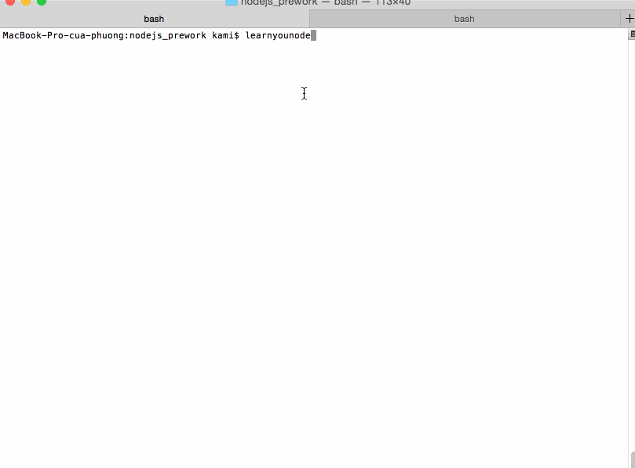

# Proxy Server

This is a Proxy Server for Node.js submitted as the [pre-work](http://learning.coderschool.vn/snippets/_intro_to_nodejs/prework) requirement for CoderSchool.

Time spent: 14

Completed:

* [x] Required: Requests to port `8000` are echoed back with the same HTTP headers and body
* [x] Required: Requests/reponses are proxied to/from the destination server
* [x] Required: The destination server is configurable via the `--host`, `--port`  or `--url` arguments
* [x] Required: The destination server is configurable via the `x-destination-url` header
* [x] Required: Client requests and respones are printed to stdout
* [x] Required: The `--logfile` argument outputs all logs to the file specified instead of stdout
* [] Optional: The `--exec` argument proxies stdin/stdout to/from the destination program
* [x] Optional: The `--loglevel` argument sets the logging chattiness
* [x] Optional: Supports HTTPS
* [x] Optional: `-h` argument prints CLI API
* [x] Optional: Tweak the log styling, play with colors, spacing and additional data

Walkthrough Gif:
[Add walkthrough.gif to the project root]



Note: to embed the gif file, just check your gif file into your repo and update the name of the file above.

## Starting the Server

```bash
npm start
```

## Features

### Echo Server:

```bash
curl -v http://localhost:8000 -d "hello vietnam"
* Rebuilt URL to: http://localhost:8000/
*   Trying 127.0.0.1...
* Connected to localhost (127.0.0.1) port 8000 (#0)
> POST / HTTP/1.1
> Host: localhost:8000
> User-Agent: curl/7.43.0
> Accept: */*
> Content-Length: 13
> Content-Type: application/x-www-form-urlencoded
> 
* upload completely sent off: 13 out of 13 bytes
< HTTP/1.1 200 OK
< host: localhost:8000
< user-agent: curl/7.43.0
< accept: */*
< content-length: 13
< content-type: application/x-www-form-urlencoded
< Date: Sat, 01 Oct 2016 10:01:45 GMT
< Connection: keep-alive
< 
* Connection #0 to host localhost left intact
hello vietnam
```

### Proxy Server:

Port 8001 will proxy to the echo server on port 8000.

```bash
curl -v http://localhost:8001 -d "hello vietnam"
* Rebuilt URL to: http://localhost:8001/
*   Trying 127.0.0.1...
* Connected to localhost (127.0.0.1) port 8001 (#0)
> POST / HTTP/1.1
> Host: localhost:8001
> User-Agent: curl/7.43.0
> Accept: */*
> Content-Length: 13
> Content-Type: application/x-www-form-urlencoded
> 
* upload completely sent off: 13 out of 13 bytes
< HTTP/1.1 200 OK
< host: localhost:8001
< user-agent: curl/7.43.0
< accept: */*
< content-length: 13
< content-type: application/x-www-form-urlencoded
< connection: close
< date: Sat, 01 Oct 2016 09:57:53 GMT
< 
* Closing connection 0
hello vietnam
```


### Proxy Server (ssl protocol):

Port 9001 will proxy to the ssl echo server on port 9000.

```bash
curl -v -k https://localhost:9001 -d "hello vietnam"
* Rebuilt URL to: https://localhost:9001/
*   Trying 127.0.0.1...
* Connected to localhost (127.0.0.1) port 9001 (#0)
* TLS 1.2 connection using TLS_ECDHE_RSA_WITH_AES_128_CBC_SHA256
* Server certificate: localhost
* Server certificate: ca
> POST / HTTP/1.1
> Host: localhost:9001
> User-Agent: curl/7.43.0
> Accept: */*
> Content-Length: 13
> Content-Type: application/x-www-form-urlencoded
> 
* upload completely sent off: 13 out of 13 bytes
< HTTP/1.1 200 OK
< host: localhost:9001
< user-agent: curl/7.43.0
< accept: */*
< content-length: 13
< content-type: application/x-www-form-urlencoded
< connection: close
< date: Sat, 01 Oct 2016 10:05:25 GMT
< 
* Closing connection 0
hello vietnam
```

### Configuration:

#### CLI Arguments:

The following CLI arguments are supported:

##### `--host`

The host of the destination server. Defaults to `127.0.0.1`.

##### `--port`

The port of the destination server. Defaults to `80` or `8000` when a host is not specified.

##### `--url`

A single url that overrides the above. E.g., `http://www.google.com`

##### `--logFile`

Specify a file path to redirect logging to.

#### Headers

The follow http header(s) are supported:

##### `x-destination-url`

Specify the destination url on a per request basis. Overrides and follows the same format as the `--url` argument.
